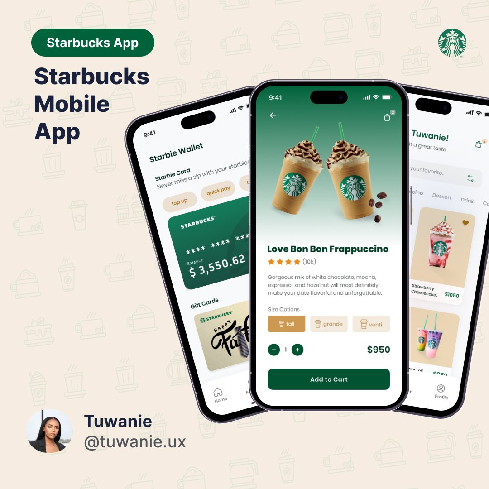

<div align="center" id="top"> 
  

  &#xa0;
  
</div>

<h1 align="center">Starbucks Mobile RN Expo</h1>

<p align="center">
  

  

  

  
</p>

<hr>

<p align="center">
  <a href="#dart-about">About</a> &#xa0; | &#xa0; 
  <a href="#sparkles-features">Features</a> &#xa0; | &#xa0;
  <a href="#rocket-technologies">Technologies</a> &#xa0; | &#xa0;
  <a href="#white_check_mark-requirements">Requirements</a> &#xa0; | &#xa0;
  <a href="#checkered_flag-starting">Starting</a> &#xa0; | &#xa0;
  <a href="#memo-license">License</a> &#xa0; | &#xa0;
  <a href="https://github.com/gregorywoolery" target="_blank">Author</a>
</p>

<br>

## :dart: About ##

This project was inspired by a Twitter Post by [tuwanie.ux](https://twitter.com/tuwanie/status/1665531902730596352?s=61&t=_G2qZFnjC2faO5o0o20dCw). It is a demo Starbucks Mobile App using React Native and Expo.

## :sparkles: Features ##

:heavy_check_mark: Dark Mode;\
:heavy_check_mark: View List of Products;\
:heavy_check_mark: View a single Product;\
:heavy_check_mark: View Wallet;



## :rocket: Technologies ##

The following tools were used in this project:

- [Expo](https://expo.io/)
- [Node.js](https://docs.expo.dev/get-started/installation/)
- [React](https://react.dev/)
- [React Native](https://reactnative.dev/)
- [TypeScript](https://www.typescriptlang.org/)

## :white_check_mark: Requirements ##

Before starting :checkered_flag:, you need to have [Git](https://git-scm.com) and [Expo](https://docs.expo.dev/get-started/installation/) installed.

## :checkered_flag: Starting ##

```bash
# Clone this project
$ git clone https://github.com/gregorywoolery/starbucks-mobile.git

# Access
$ cd starbucks-mobile

# Install dependencies
$ npm install

# Run the project: Expo Go App
$ npm run start

## :memo: License ##

This project is under license from MIT. For more details, see the [LICENSE](LICENSE.md) file.


Made with :heart: by <a href="https://github.com/gregorywoolery" target="_blank">Gregory Woolery</a>

&#xa0;

<a href="#top">Back to top</a>
